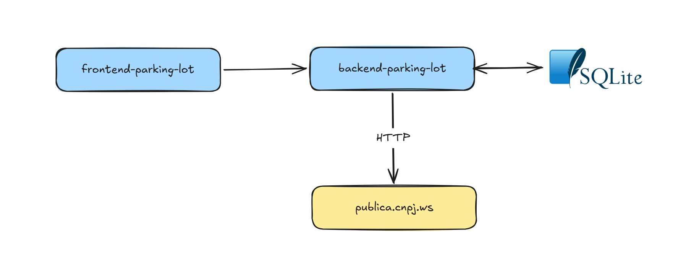

# Backend Parking Lot

API para gerenciamento de um estacionamento: cadastro da configuração do local
(área, capacidade e preço por hora) e controle das vagas numeradas (ocupação
e liberação).

---
## Arquitetura



O frontend consome a API REST do backend, que persiste os dados em um banco
SQLite e, ao registrar a entrada de um veículo de uma empresa (CNPJ), consulta
a API pública da [cnpj.ws](https://docs.cnpj.ws/) via HTTP.

---
## Como executar

Após clonar o repositório, acesse o diretório raiz do projeto pelo terminal
para executar os comandos abaixo.

### 1. Criar e ativar um ambiente virtual

> É fortemente indicado o uso de ambientes virtuais, como o
> [venv](https://docs.python.org/3/library/venv.html).

No Windows (PowerShell):
```
python -m venv .venv
.venv\Scripts\Activate.ps1
```

No Linux/macOS:
```
python -m venv .venv
source .venv/bin/activate
```

### 2. Instalar as dependências

```
(.venv)$ pip install -r requirements.txt
```

### 3. Executar a aplicação

```
(.venv)$ python app.py
```

Ou, alternativamente, usando o CLI do Flask (com reload automático a cada
mudança no código):

```
(.venv)$ flask run --host 0.0.0.0 --port 5000 --reload
```

O banco de dados SQLite (`database/db.sqlite3`) e suas tabelas são criados
automaticamente na primeira execução.

### 4. Acessar a aplicação

Com o servidor rodando, a documentação interativa (Swagger) fica disponível em
[http://localhost:5000/openapi/swagger](http://localhost:5000/openapi/swagger).

---
## Como executar com Docker

Alternativamente, é possível executar a aplicação em um container Docker, sem
precisar instalar Python ou as dependências localmente.

### 1. Construir a imagem

Na raiz do projeto, execute:
```
docker build -t backend-parking-lot .
```

### 2. Executar o container

```
docker run -p 5000:5000 backend-parking-lot
```

O banco de dados SQLite (`database/db.sqlite3`) é criado automaticamente
dentro do container na primeira execução. Caso queira persistir os dados
entre reinicializações do container, monte a pasta `database` como volume:

```
docker run -p 5000:5000 -v "$(pwd)/database:/app/database" backend-parking-lot
```

> No Windows (PowerShell), substitua `$(pwd)` por `${PWD}`.

### 3. Acessar a aplicação

Com o container rodando, a documentação interativa (Swagger) fica disponível
em [http://localhost:5000/openapi/swagger](http://localhost:5000/openapi/swagger).

---
## Rotas disponíveis

### Configuração do estacionamento

| Método | Rota            | Descrição                                                                 |
|--------|-----------------|---------------------------------------------------------------------------|
| GET    | `/configuracao` | Retorna a configuração cadastrada                                         |
| POST   | `/configuracao` | Cadastra a configuração (única) e gera as vagas                           |
| PUT    | `/configuracao` | Atualiza a configuração e ajusta as vagas                                 |
| PATCH  | `/configuracao` | Atualiza parcialmente a configuração (e as vagas, se a capacidade mudar)  |
| DELETE | `/configuracao` | Remove a configuração e todas as vagas (bloqueado se houver vaga ocupada) |

Corpo esperado (POST/PUT/PATCH — no PATCH todos os campos são opcionais):
```json
{
  "area": 500.0,
  "capacidade": 50,
  "preco_hora": 5.0
}
```

### Vagas

| Método | Rota                      | Descrição                                            |
|--------|---------------------------|------------------------------------------------------|
| GET    | `/vagas`                  | Lista todas as vagas                                 |
| GET    | `/vagas/<numero>`         | Detalha uma vaga específica                          |
| PUT    | `/vagas/<numero>/ocupar`  | Ocupa a vaga com a placa informada                   |
| PUT    | `/vagas/<numero>/liberar` | Libera a vaga e registra o pagamento automaticamente |

Corpo esperado (PUT `/vagas/<numero>/ocupar`):
```json
{
  "placa": "ABC1D23",
  "observacao": "Cliente aguardando revisão do veículo",
  "cpf_cnpj": "33555921000170"
}
```

Os campos `observacao` e `cpf_cnpj` são opcionais. O `cpf_cnpj` deve conter
somente números (11 dígitos para CPF ou 14 para CNPJ). Quando é informado um
CNPJ, a razão social e os dados de contato (telefone e e-mail) da empresa são
consultados automaticamente na API pública
[publica.cnpj.ws](https://publica.cnpj.ws) e retornados junto com a vaga; para
CPF, nenhuma consulta é realizada. Se o CNPJ não for encontrado ou o serviço
de consulta estiver indisponível, a ocupação da vaga não é efetuada e um erro
(`404` ou `502`, respectivamente) é retornado.

Ao liberar uma vaga (`PUT /vagas/<numero>/liberar`), o pagamento é calculado e
registrado automaticamente: o tempo de permanência é arredondado para cima em
horas (mínimo de 1 hora) e multiplicado pelo `preco_hora` vigente na
configuração. Não é necessário informar nada no corpo da requisição.

### Pagamentos

| Método | Rota          | Descrição                                                   |
|--------|---------------|-------------------------------------------------------------|
| GET    | `/pagamentos` | Lista os pagamentos, com filtro opcional `?data=AAAA-MM-DD` |

Os pagamentos são criados automaticamente ao liberar uma vaga — não há rota
para inseri-los manualmente.

---
## Integração externa: consulta de CNPJ

Ao ocupar uma vaga (`PUT /vagas/<numero>/ocupar`) informando um CNPJ (14
dígitos) no campo `cpf_cnpj`, o backend consulta automaticamente os dados
cadastrais da empresa na API pública da **cnpj.ws** (documentação oficial em
[docs.cnpj.ws](https://docs.cnpj.ws/)), usando o endpoint:

```
GET https://publica.cnpj.ws/cnpj/{cnpj}
```

Exemplo de chamada, para o CNPJ `33555921000170`:
```
GET https://publica.cnpj.ws/cnpj/33555921000170
```

Exemplo de retorno:
```json
{
  "cnpj_raiz": "33555921",
  "razao_social": "FACULDADES CATOLICAS",
  "capital_social": "0.00",
  "porte": { "id": "05", "descricao": "Demais" },
  "natureza_juridica": { "id": "3999", "descricao": "Associação Privada" },
  "estabelecimento": {
    "cnpj": "33555921000170",
    "tipo": "Matriz",
    "nome_fantasia": "PUC RIO",
    "situacao_cadastral": "Ativa",
    "data_situacao_cadastral": "2001-04-28",
    "data_inicio_atividade": "1966-09-28",
    "tipo_logradouro": "RUA",
    "logradouro": "MARQUES DE SAO VICENTE",
    "numero": "225",
    "bairro": "GAVEA",
    "cep": "22451900",
    "ddd1": "21",
    "telefone1": "35271045",
    "email": "nfe@puc-rio.br",
    "atividade_principal": {
      "id": "8532500",
      "descricao": "Educação superior - graduação e pós-graduação"
    },
    "estado": { "id": 19, "nome": "Rio de Janeiro", "sigla": "RJ" },
    "cidade": { "id": 3243, "nome": "Rio de Janeiro" }
  }
}
```
*(retorno resumido; a API também traz o quadro societário (`socios`) e outros
campos que não são utilizados por este projeto)*

Do retorno acima, o backend (`cnpj_service.py`) extrai apenas:
- `razao_social` → razão social da empresa
- `estabelecimento.ddd1` + `estabelecimento.telefone1` → telefone de contato
- `estabelecimento.email` → e-mail de contato

Esses três campos são gravados na vaga e retornados junto com ela. Caso o
CNPJ não seja encontrado ou o serviço esteja indisponível, a ocupação da vaga
é abortada (ver seção [Vagas](#vagas)).
